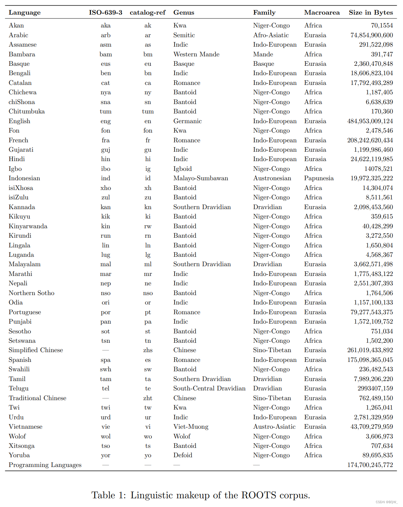
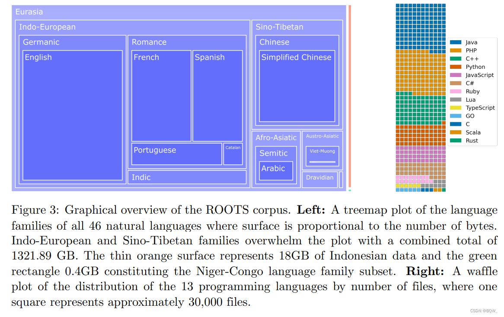
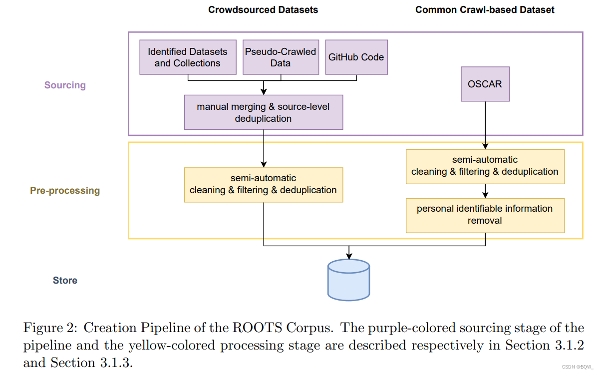

## BigScience Large Open-science Open-access Multilingual Language Model
* finetuned BLOOM to produce [BLOOMZ] & our guide is here[https://github.com/bigscience-workshop/xmtf#bloomz].
* [https://huggingface.co/bigscience/bloomz]
* official paper "BLOOM: A 176B-Parameter Open-Access Multilingual Language Model" [https://arxiv.org/abs/2211.05100]
* The architecture of BLOOM is essentially similar to GPT3 (auto-regressive model for next token prediction), but has been trained on 46 different languages and 13 programming languages. 
*
* 
* BLOOM是在一个称为ROOTS的语料上训练的，其是一个由498个HuggingFace数据集组成的语料。共计1.61TB的文本，包含46种自然语言和13种编程语言。上图3展示了该数据集的高层概览，上表1则详细列出了每种语言及其语属、语系和宏观区域。除了产生了语料库之外，该过程也带来了许多组织和技术工具的开发和发布。
* 语言选择：首先列出8个世界上使用人数最多的语言，在项目早期积极推广这些语言并邀请该语言的流利使用者加入项目。然后，根据社区的建议将原始选择中的Swahili扩展至Niger-Congo语言类别，Hindi和Urdu扩展至Indic languages。
* 

* preprocessing 
* original data

第一步涉及到从确定的数据源中获得文本数据，这包含从各种格式的NLP数据集中下载和提取文本字段、从档案中抓取和处理大量的PDF文件、从目录中的192个网站条目和数据工作组成员选择的另一些地理上不同的456个网站中提取和预处理文本。后者需要开发新工具来从Common Crawl WARC文件中的HTML中抽取文本。我们能够从539个网络的所有URL中找到并提取可用的数据。

* filter

在获得文本后，我们发现大多数源中包含了大量的非自然语言，例如预处理错误、SEO页面或者垃圾。为了过滤非自然语言，我们定义了一组质量指标，其中高质量文本被定义为“由人类为人类编写的”，不区分内容或者语法的先验判断。重要的是，这些指标以两种主要的方法来适应每个源的需求。首先，它们的参数，例如阈值和支持项列表是由每个语言的流利使用者单独选择的。第二、我们首先检测每个独立的源来确定哪些指标最有可能确定出非自然语言。这两个过程都是由工具进行支持来可视化影响。

* petals: decentralized BLOOM-176B inference and fine-tuning in Google Colab[https://colab.research.google.com/drive/1Ervk6HPNS6AYVr3xVdQnY5a-TjjmLCdQ?usp=sharing]]
* chatbot link: [http://chat.petals.ml/]
* reference:[https://huggingface.co/docs/transformers/model_doc/bloom]
* 源代码解析：[https://baiqw.blog.csdn.net/article/details/130694055]
* 训练BLOOM模型时使用的硬件设置和技术组件:硬件包括384个英伟达A100 80GB GPU，另外还有32个备用GPU，以及一个AMD EPYC 7543 32核处理器，还有充足的CPU和GPU内存。训练过程利用了Megatron-DeepSpeed软件，该软件将DeepSpeed深度学习优化库与英伟达开发的Megatron-LM转化器模型框架相结合
* Megatron-DeepSpeed方法采用了几种技术来实现大型模型的有效训练。这些技术包括使用DataParallel、TensorParallel和PipelineParallel的3D并行性，以及用于内存优化的零冗余优化器（ZeRO）。
* Megatron的一个重要特征是高效的数据加载器。在启动初始训练时，每个数据集被分成所要求的序列长度的样本（BLOOM为2048），并创建索引为每个样本编号。根据训练参数，计算出数据集的历时数，并为该历时数创建一个排序，然后进行洗牌。例如，如果一个数据集有10个样本，并且应该经过两次，系统首先按照[0, ..., 9, 0, ..., 9]的顺序排列样本索引，然后洗牌，为数据集创建最后的全局顺序。请注意，这意味着训练不会简单地通过整个数据集，然后重复进行，有可能在看到另一个样本之前，就已经看到了同一个样本两次，但在训练结束时，模型将看到每个样本两次。这有助于确保在整个训练过程中形成平滑的训练曲线。这些指数，包括进入每个样本的基础数据集的偏移量，被保存到一个文件中，以避免每次训练过程开始时重新计算它们。然后，这些数据集中的几个可以用不同的权重混合成训练过程中看到的最终数据。